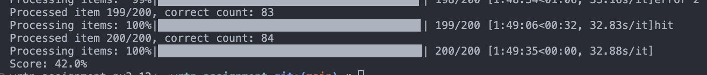

# 최영섭 뤼튼 브레인팀 과제

# 프로젝트 설정

## 1. .env 파일 생성

프로젝트 루트 디렉토리에 `.env` 파일을 생성하고 메일로 전달드린 notion파일 내에 .env코드를 복사 후 붙여넣기 해주세요
환경변수는 다음 요소들을 포함하고있습니다.

```
OPENAI_API_KEY="openai_api_key"

PINECONE_API_KEY="pinecone_api_key"

INDEX_NAME="criminal-law-renew"

FILE_NAME="criminal_law.txt"

EMBEDDING_DIMENSIONS = 512

EMBEDDING_MODEL = "text-embedding-3-small"

SERPER_API_KEY = "serper_api_key"

```

## 2. 도커 파일 빌드 및 실행

```
docker-compose up --build
```

## 3. 테스트 진행

이후 테스트가 자동으로 실행됩니다.
테스트가 진행되는 동안 진행된 테스트 수, 맞은 데이터 수를 확인할 수 있으며 테스트가 종료된 후에는 아래와 같이 나타납니다.
예시)

```
# 예시)
Score: 40.0%
```

# 벤치마크

## 벤치마크 결과 (naive gpt-4o-mini)

| 지표     | 결과  |
| -------- | ----- |
| Hit Rate | 33.5% |

## 벤치마크 결과 (structured gpt-4o-mini)

| 지표     | 결과  |
| -------- | ----- |
| Hit Rate | 42.0% |



올바르지 않은 데이터 2개가 오답 처리된 값입니다.
test[16], test[62]

## 결과 확인

bach api적용 및 input, output json파일을 준비하지 못하여 아래 파일로 대체하였습니다. 죄송합니다.
처리된 output 값은 test_results_post.json파일 내에서 확인 가능합니다.

### processed_choice

단일 테스트 데이터가 들어오면 이를 질문-선지1, 질문-선지2 와 같은 식으로 매칭한 뒤 처리합니다.
문제에서 찾고자하는 target bool(옳은 것은 고르시오 -> True, 옳지 않은 것을 고르시오 -> False)
4번의 실행에서 각 질문-선지 세트에 대해 옳은지 판단하고 결과물로 True, False값을 반환합니다.
해당 각 실행에서의 결과는 아래와 같습니다.
| 키 | 설명 |
|------------------|----------------------------------------------------------------------|
| `choice` | 처리한 선지 text |
| `question` | 해당 테스트 샘플의 질문 |
| `final_answer` | 해당 선지가 올바른지 판단한 boolean값 |
| `thinking_process` | 모델이 답변을 도출하는 과정에서의 추론 과정 |
| `web_reference` | 모델이 활용한 웹(serper api 활용) 기반 참조 자료 |
| `law_reference` | 모델이 활용한 hybrid-retrieval(kiwi-bm25 + vector search) 기반 참조 자료 |

### return

각 실행에서 나온 값들중 target boolean과 동일한 결과를 만든(ex. 옳은 것을 찾으시오-target boolean이 True일때 해당 선지를 True라고 판단한) 선지들을 수집합니다.
만약 그러한 선지가 하나라면 해당 선지를 generated_answer로 처리하고 만약 2개 이상이거나 0개라면 수집된 값들의 thinking_process들을 모아서 다시 한 번 답을 결정합니다.(0개일때는 모든 선지들을 처리하도록)
결과적으로 그렇게 만들어진 generated_answer과 original_answer을 비교하고 일치한다면 is_correct가 True가 됩니다.
| 키 | 설명 |
|------------------------|----------------------------------------------------------------------|
| `selected_choices` | 모델이 선택한 답안들의 리스트(target boolean과 동일한 결과를 만든 선지들의 결과 리스트입니다.위 processed_choice의 리스트) |
| `selected_choices_count` | 모델이 선택한 답안의 총 개수 |
| `generated_answer` | 모델이 최종적으로 생성한 답변 |
| `is_correct` | 모델의 답변이 정답인지 여부 (`True` 또는 `False`) |
| `original_answer` | 데이터셋에 제공된 정답 |
